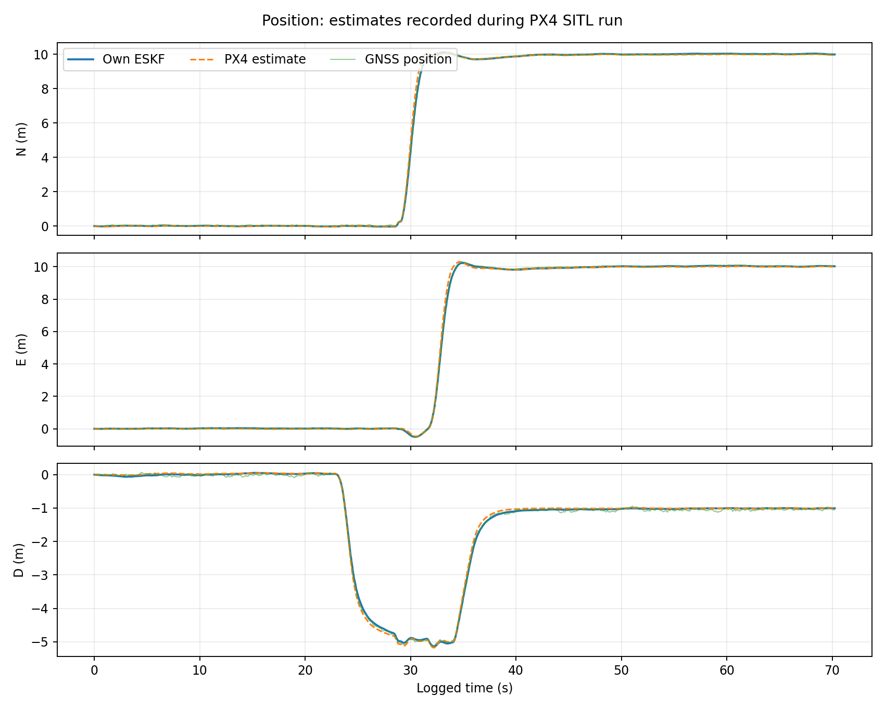
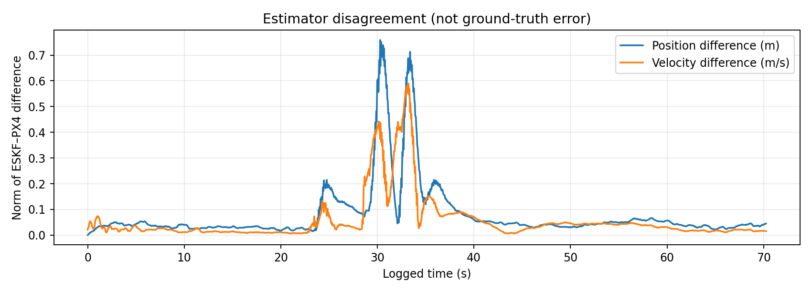
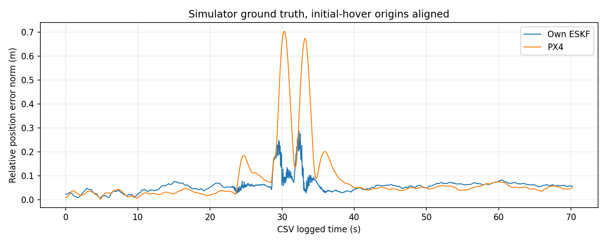
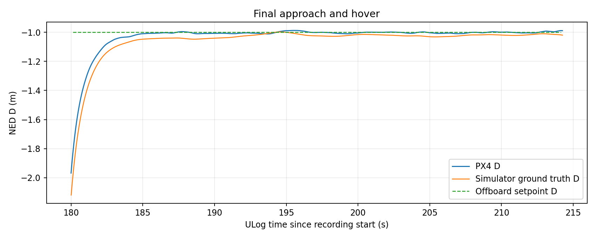

# UAV error-state Kalman filter in PX4 SITL

A Python/ROS 2 implementation of a 15-state error-state Kalman filter (ESKF) for a simulated multirotor. The filter propagates position, velocity, attitude, and IMU biases with IMU data, then corrects position and velocity with GNSS. A separate Offboard node flies four waypoints. This repository includes the authored source and one complete run with a PX4 ULog, CSV, analysis scripts, and figures.

**Scope:** PX4 SITL only. The Offboard controller uses PX4's local-position feedback; it does not close the loop on this ESKF. The filter initializes its attitude from PX4's attitude estimate. These results describe one flight, not hardware validation or a general comparison of estimators.

## What I built

| Package | Purpose |
| --- | --- |
| `src/px4_eskf` | ESKF prediction, GNSS position/velocity correction, comparison logging |
| `src/px4_offboard_control` | Position setpoints `(0,0,-5) → (10,0,-5) → (10,10,-5) → (10,10,-1)` in NED metres |
| `src/px4_state_listener` | Displays PX4 position, velocity, and attitude for diagnosis |

The nominal state is `(p, v, R, b_g, b_a)`, with 15 local error components `(δp, δv, δθ, δb_g, δb_a)`. IMU propagation integrates bias-corrected angular rate and acceleration, including NED gravity. Covariance propagation uses a first-order transition and the attitude-to-velocity block `−R[a−b_a]×`. A six-component GNSS position/velocity residual corrects the state; the covariance update uses Joseph form and an attitude reset Jacobian.

One concrete debugging step was correcting elementwise multiplication in the attitude-to-velocity Jacobian to matrix multiplication (`-R @ hat(f)`). The earlier error produced unstable bias estimates in SITL.

`px4_msgs`, PX4, and the Micro XRCE DDS Agent are external dependencies. They are not vendored here.

## Recorded mission

The [CSV](data/eskf_vs_px4.csv) has 1,489 rows across 70.24 seconds; the [PX4 ULog](data/08_56_47.ulg) contains simulator ground truth and mode history. The vehicle reaches the last `(10,10,-1)` setpoint and remains near it. The final recorded ESKF position is `(9.992, 10.023, -1.006)` m; PX4's is `(9.958, 9.996, -0.994)` m. The ULog's last trajectory setpoint is exactly `(10,10,-1)`, Offboard mode persists through log end, and the failsafe flag is false. The Offboard heartbeat continues until 0.116 seconds before recording ends.

The following is **agreement between the two estimates**, measured as RMS Euclidean difference across logged rows. Agreement alone is not accuracy.

| Trajectory interval, approximate | Position difference | Velocity difference |
| --- | ---: | ---: |
| Whole CSV | 0.139 m | 0.106 m/s |
| Initial hover, 0–20 s | 0.034 m | 0.022 m/s |
| First legs, 20–30 s | 0.135 m | 0.120 m/s |
| Fast horizontal motion, 30–35 s | 0.464 m | 0.348 m/s |
| Final hover, 40–70.24 s | 0.044 m | 0.032 m/s |





### Comparison with simulator ground truth

The CSV time column jumps forward relative to ULog time twice, around rows 136 and 580. A single clock offset would misalign the fast legs. The [ground-truth script](analysis/groundtruth.py) recovers the CSV's PX4 local-position origin from an identical velocity sample, then matches **all 1,489 rows exactly** to PX4 position/velocity samples in the ULog (maximum six-dimensional sample discrepancy `2.6e-15`). Ground truth is interpolated to each matched ULog sample time.

The ESKF's GNSS origin and PX4's local origin differ from the simulator's origin. Relative-position error subtracts each estimate's mean offset to ground truth over the initial 10 CSV seconds. Velocity error needs no origin adjustment. Values below are RMS Euclidean norms across the run.

| Against simulator ground truth | Own ESKF | PX4 estimate |
| --- | ---: | ---: |
| Relative position | 0.065 m | 0.143 m |
| Velocity | 0.084 m/s | 0.092 m/s |



In this single run, the ESKF's relative-position error is lower than PX4's overall, especially in the fast horizontal leg. PX4 has lower error in the initial and final hover. The estimators share simulated sensor data, and the custom ESKF initializes attitude from PX4; this cannot establish general superiority or independent estimator performance.



### Measurement limits

CSV rows come from a 50 ms ROS timer using the latest values from asynchronous callbacks. An exact PX4 sample match identifies the PX4 sample time for each row, but does not prove that the ESKF state in that same row was updated at precisely that time. Multiple CSV timestamps repeat; the two larger clock discontinuities are explicitly handled by sample matching. The CSV does not record GNSS velocity, ESKF covariance, innovations, or per-update timestamps, so this run cannot support a delay or NIS/NEES consistency analysis. The implementation does not compensate delayed or out-of-sequence GNSS measurements or reject invalid GNSS fixes after initialization. Noise covariances are experimental settings rather than a published calibration.

An [earlier run and Offboard-loss diagnosis](docs/previous_failsafe_run.md) are retained as a debugging case study. The clean run above does not establish why that earlier controller heartbeat stopped; no root-cause code fix is claimed.

## Reproduce the analysis

With Python and [analysis dependencies](requirements-analysis.txt):

```bash
python -m pip install -r requirements-analysis.txt
python analysis/compare.py data/eskf_vs_px4.csv --out figures
python analysis/groundtruth.py data/eskf_vs_px4.csv data/08_56_47.ulg --out figures
```

The ULog identifies `PX4_SITL`, PX4 `main`, software commit `d57d7f3b11c044b86195a12cfb933d17fac85b34`. The exact ROS 2, `px4_msgs`, Python, and DDS Agent versions still need to be recorded from the development machine.

## Run the ROS 2 packages

With a compatible PX4 SITL, ROS 2 installation, matching `px4_msgs`, and a running Micro XRCE DDS Agent, use this repository as a colcon workspace:

```bash
colcon build --packages-select px4_eskf px4_offboard_control px4_state_listener
source install/setup.bash
ros2 run px4_eskf eskf_node
```

In separate sourced terminals, run `ros2 run px4_offboard_control offboard_control` for the waypoint mission and, optionally, `ros2 run px4_state_listener state_listener` for diagnostics. Start SITL and the DDS Agent before these nodes. The ESKF writes `eskf_vs_px4.csv` in its current directory, overwriting that name on each run. End-to-end setup commands should be verified on a clean machine before public release.

## Before public release

Replace placeholder maintainer email addresses with an address you want visible on GitHub. Verify the ROS 2/PX4 setup and note the tested versions. The package metadata declares Apache-2.0 and includes license files.
