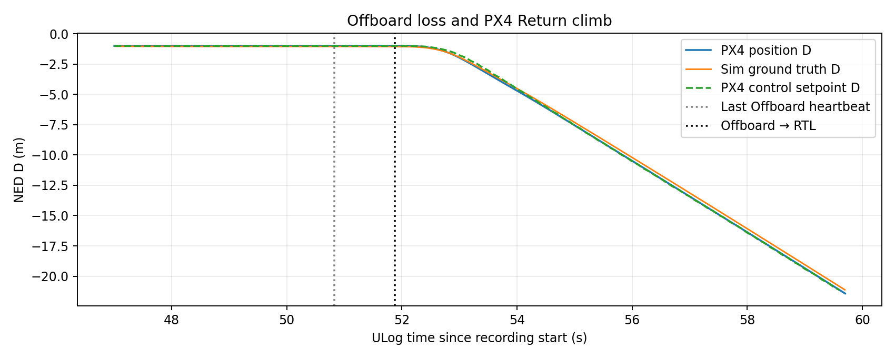

# Earlier run: Offboard-loss diagnosis

The earlier [CSV](../data/previous_failsafe_run.csv) and [ULog](../data/17_19_46.ulg) cover a different SITL flight. After the final `(10,10,-1)` waypoint, the aircraft climbed while its horizontal position stayed near `(10,10)`. The ULog explains the behavior:

| ULog time | Recorded event |
| ---: | --- |
| 50.824 s | Last received `offboard_control_mode` heartbeat; last Offboard setpoint remained `(10,10,-1)` |
| 51.864 s | `failsafe_flags.offboard_control_signal_lost` became true |
| 51.876 s | `vehicle_status.nav_state` changed from OFFBOARD (14) to AUTO_RTL (5) |
| 51.876 s | PX4 reported `RTL: start return at 31 m (30 m above destination)` |

`COM_OF_LOSS_T` was 1.0 second. PX4's Return mode commanded the climb; the simulator ground truth followed it. The ULog cannot establish why the ROS 2 heartbeat stopped (node exit, stall, or connection loss). The controller source has no planned stop at the final waypoint. A later run, featured in the main README, stayed in Offboard mode through its final hover.



To recreate the earlier diagnostics, run:

```bash
python analysis/groundtruth_and_failsafe.py data/previous_failsafe_run.csv data/17_19_46.ulg --out figures/previous_run
```

The script reports a single 8.029-second clock offset and computes origin-aligned ground-truth errors for that earlier run. Its figures and numbers pertain only to that flight.
